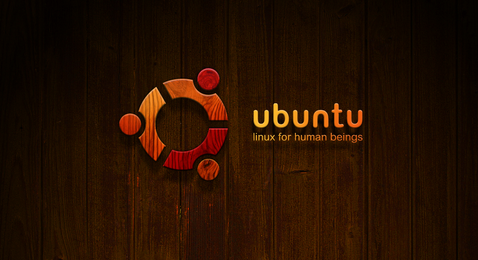
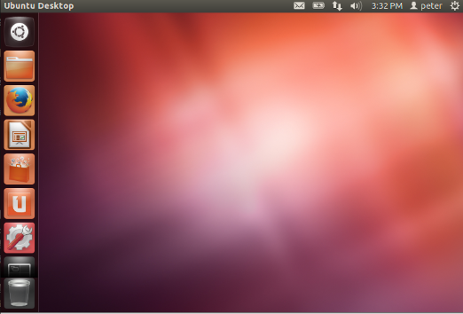
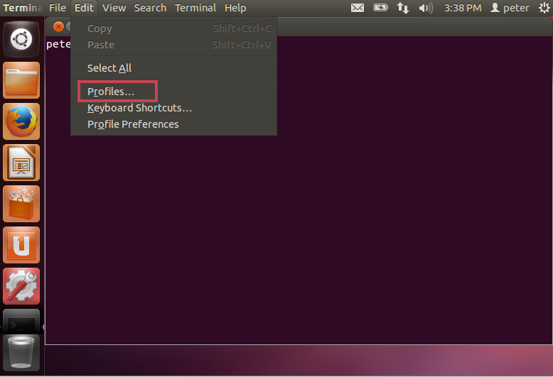
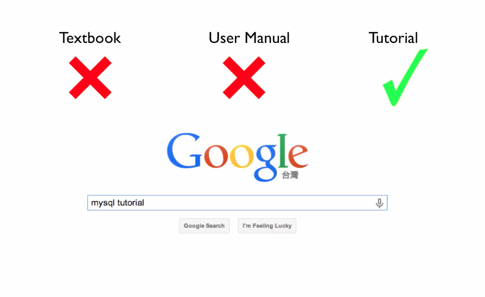

[观看视频](http://www.imooc.com/video/3525)


现在我们一起走入 Linux 命令行的精彩世界。学 Linux 应该说主要就是学命令行。有句话说得好：

>图形界面让简单的任务变得更简单，但是命令行让复杂的任务变得可能
> Graphical user interfaces make easy tasks easy, while command line interfaces make difficult tasks possible

作为 developer 使用好命令行是基本功之一。Windows 下的 dos 命令行功能太少了，开发中根本没法用。

这一集里，首先带大家选择一款合适的 Linux 操作系统，演示一下如何配置命令行终端软件，然后宏观介绍一下什么是 Linux 系统的命令，应该如何学习各种各样命令。

# 选择操作系统

Linux 其实是分很多版本的，在 <http://en.wikipedia.org/wiki/Linux_distribution> 页面上我们可以看到各个 Linux 的发行版可谓多如牛毛，常见有 Redhat，CentOS，fedora 等等。但是 Redhat 和 CentOS 主要是在大企业服务方面见长，我以前服务过的一间公司，其实基本上就是仿效 Redhat 的商业模式的。而在创业领域，观察一下圈子内最著名的 VPS 提供商，例如 aliyun，和国外的 Linode，aws，digitalocean 这些公司，我感觉 ubuntu 是最受欢迎的服务器部署平台，至少是之一。另外，如果你像我一样，把 ubuntu 安装在自己的机器上做开发机用，ubuntu 的表现也是非常优秀。

目前我们可以拿到的 ubuntu LTS
长期支持版本有，2012年发布的12.04系统，还有2014年4月发布的14.04版，这里我们选择使用12.04。之所以不采用
14.04 是因为太新，很多东西网上还找不到资料，出了问题不容易解决。同时如果我们到
<https://wiki.ubuntu.com/LTS>
可以看到12.04支持期是5年，所以依旧是可以放心使用的。可以到这个页面上进行下载

<http://releases.ubuntu.com/12.04/>



安装过程可以参考我录的一个视频： <http://happycasts.net/episodes/11>

# 打开并设置终端

好，如果我们已经把系统装好，启动之后就是这个样子。



使用命令行，我们先要打开一个叫做”终端“的软件，这个软件是系统已经预装的了，所以我们可以敲 Super 键（在我这里是右侧的 Cmd 键，如果你用的是 PC，那么可能是你右侧的 window 键）调出快速启动框，敲 terminal 也就是终端的英文，然后回车即可。

其实，终端是指我们打开的这个窗口，里面我们看到的，真正运行的程序叫 shell，shell 有很多种，zsh csh 等等，但是在现在大部分最常见的 Unix 类的系统上，例如,苹果的 Mac 系统，红帽系统，包括我们这里的 ubuntu 系统，使用的都是一种叫 Bash 的 shell。

如果我们在终端里执行

    $ python
    >>>

这样，终端里运行的就不是 bash 了，而是 python 语言。Ctrl-D 可以退出 python 回到 bash 。

下面更改一下终端样式，点击 edit -> profiles



打开的界面中点击 “new” 来创建一个新的 profile 比如起名字叫 'imooc' 这样我们就可以随意的设置这个 profile 对应的颜色和字体了，比如，我们把颜色设置为 “black on white”，字体设为 “font-size: 20”，关闭当前选项卡，设置 “Profile used when launching a new terminal:" 为 "imooc"，这样以后每次启动终端的时候，咱们刚才的设置就会被应用了。

当然，我们也可以随时用 ”Ctrl++“ 和 ”Ctrl--" 对终端字体大小进行调整。关闭当前 shell，使用 “Ctrl-D"。

隐藏启动区。点击启动区的系统设置图标（ systerm settings ），到 Personal -> Appearance 条目下，选择 Behavior，这样就点击开启 “Auto hide Launcher" 这个选项即可。重新唤醒启动区，敲右侧的 Cmd 键。


# 如何学习命令

命令提示符（ shell prompt ） "username@machinename" 后面跟上当前工作目录，例子

    peter@dog ~ $

其中 `~` 代表当前用户的主目录( home )，对于 peter 用户来说这个位置就是 `/home/peter`，后面我们介绍文件系统结构的时候，会对什么是当前工作目录有进一步的了解。

后面的美元符号就告诉我们可以开始输入命令了，如果我们随便输入一些字符，就会报错 “command not found"。

一个合法的命令一般由三部分组成，命令本身，命令参数，操作对象。命令的例子：

    $ ls
    $ mkdir ttt
    $ rm -r ttt

作为开发者，入手一个新的工具的时候，基本原则不必每个知识点都逐一学习，实际动手中学习就好了。如果要看书，千万不要看手册型的大部的课本，课本通常都讲的太深了而且是重理论轻动手。也不要看用户手册，用户手册是给已经会用这个工具的人看的。而要看 toturial，因为教程比较简短，而且都是面向实用的。具体到命令行的学习，推荐的教程是 TLCL： <http://billie66.github.io/TLCL/> 。



对于已经基本学会的命令，如果忘了具体细节，可以使用 manpage，手册。如果要查看 rm 这个命令的文档，我们可以敲

```
man rm
```

然后敲 `/-r` 就可以查找 `-r` 这个参数的意义了，查找下一处，敲 n，退出，敲 q 。

学习 Linux 的过程中还有一个问题就是很多术语不明白，可以 google，可以使用 wikipedia，不过我刚开始学的时候有一个感觉是 wikipedia 给的解释太多太全了，这时候我发现 <http://info.org> 这个网站是非常简单明了，Linux 所涉及的很多最重要的概念这个里面都有。

好，这一集就聊到这里，主要是让大家对命令行有一个初步的认识。

# 参考资料

- TLCL 第二章：什么是 shell <http://billie66.github.io/TLCL/book/zh/chap02.html>
- TLCL 第六章：使用命令 <http://billie66.github.io/TLCL/book/zh/chap06.html>
