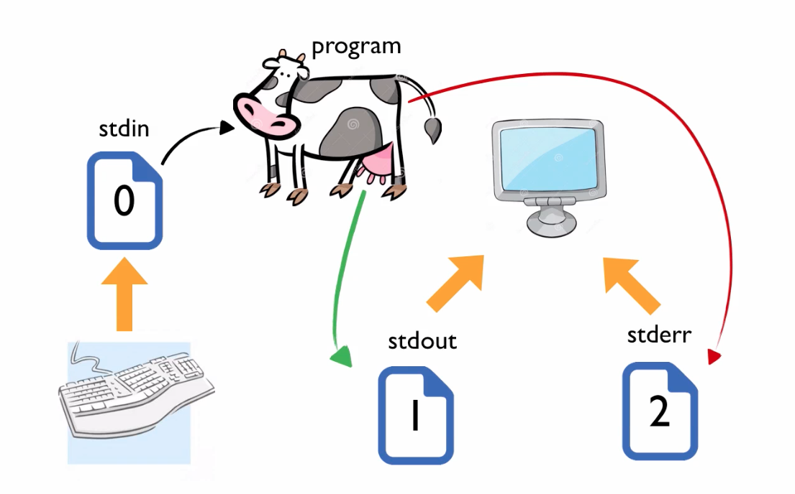
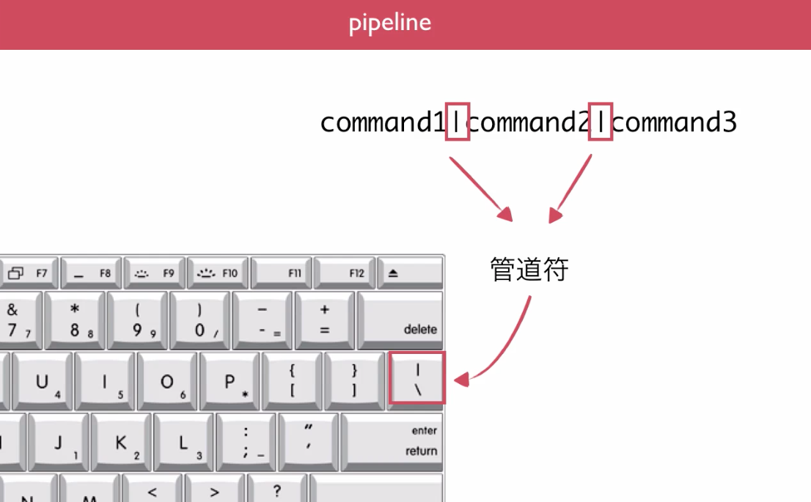

[观看视频](http://www.imooc.com/video/3530)

我们先从实际干活的时候的几个常用操作开始聊起。例如

    $ date >output.txt

这个挺好理解，就是把 date 的输出，通过这个小漏斗，保存到文件中。但是为什么这样就不灵呢？

    $ ls shit >output.txt # shit 是一个根本不存在的目录

另一个例子。开发中经常会用到 grep 命令来进行字符串查找，比如我们来找一下 /bin 目录下的所有可执行的程序中，有那些是包含 less 字样的

    $ ls /bin|grep less

这个也比较直观，这个竖线隔开前后两个命令，并且把前面命令的输出传递给后面那个命令作进一步的处理，但是为什么这样也能达成相同的效果呢

    $ ls /bin > output.txt
    $ grep less <output.txt

所以说有些时候，还是要把底层的道理搞搞清楚，干活的时候才能做到心中有数。

本集将为你揭开谜底。一共还是三部分：首先介绍系统上的三个特殊文件，第二是重定向的各种不同方式，最后是管道线。

# 三个重要的文件

Linux 有一个重要的传统，就是 Everything is a file 。一个普通文件当然是文件，一个文件夹是一个目录文件，一个程序是一个可执行的文件，甚至一个硬件设备，硬盘，鼠标，键盘，在 /dev 下面都能找到它们各自对应的文件。

每个文件自然都有文件名，但是系统还可以用另外一个东西来定位一个打开的文件，这就是“文件描述符”（ file descriptor ）。Linux 启动后，有三个文件很特殊，因为是一直打开的，所以系统就给它们分配了固定的文件描述符。

文件描述符为 0 的文件叫做 stdin （标准输入文件），描述符为1的叫做 stdout （标准输出文件），为2的叫 stderr （标准错误输出文件）。系统默认情况下，我们的键盘输入都会写入 stdin 文件，而程序执行的正常输出写到 stdout 文件，报错信息写到 stderr 文件，同时这两个文件都是默认绑定显示器的，这也就是为啥我们可以在屏幕上看到程序输出和报错的信息了。

正常情况下，在一个程序执行的时候，会从键盘也就是 stdin 中读取输入，正常的输出导入到 stdout，要是执行发生了错误，报错信息流向 stdout 。但是我们也可以动手改变这三股数据流的流向，这个就是重定向。

我们以 cowsay 这个程序为例。命令行中执行 cowsay 命令

    $ cowsay

这样程序会等待我们输入文字，敲 hello peter 然后用 Ctrl-d 结束输入，这样可以得到这样的输出。

     _____________
    < hello peter >
     -------------
            \   ^__^
             \  (oo)\_______
                (__)\       )\/\
                    ||----w |
                    ||     ||

我们完成了一个从 stdin 读入，stdout 输出的基本过程。stderr 的情况我们先卖个关子，后面我们马上就会看到它的妙用。

# 各种拐弯的方式

先说最简单的，同时也是最常用的一种重定向，标准输出重定向。

    $ cat file1 >file

这样我们就把 cat 命令的输出数据流的流向，从 stdout 改为了流向文件。这时如果我们执行

    $ cat file2 >file

想要把 file2 的内容也添加到 file 文件中，但是却发现上次的内容被覆盖了。这个是重定向符 `>` 的特点了，如果想保留原有内容不被覆盖，可以这样

    $ cat file2 >>file

我们还可以这样把两个文件弄成一个：

    $ cat file1 file2 >file

这个就等价于上面的几步操作。

现在，咱们就可以把任何一个正常的输出，重定向到一个文件中保存起来了。很多时候，一个程序是在全天候执行的，例如 web 服务器，相应的会有各种各样的正常输入产生，我们通常会把这些内容重定向到一个 log 文件中备用。但是也有时候出现了异常情况，程序出错了，那么这个信息我们是不希望被重定向掉的，而是希望能够立即在屏幕上看到输出，那么这时就是 stderr 大显身手的时候了。

    $ ls shit/ >output.txt # shit 是一个根本不存在的目录

这时我们就会看到，报错信息打印到屏幕上了，查看 output.txt 里面是没有的。这个就是我们期待的结果。不过，如果我们也想把错误输出保存到文件中，应该怎么操作呢？

    $ ls shit 2>output.txt #2是标准错误输出的文件描述符

还可以重定向输入

    $ cowsay <output.txt

# 管道线

更多的时候，我们希望把前一个程序的输出，直接作为后一个程序的输入来使用，这个就是管道线了。

    command1|command2|command3

管道线是 Linux 命令行哲学的一块基石。有了管道线的联通，各个程序就可以专注于自己的那个小任务，同时把这个小任务做的非常完善，这也就是为啥 Linux 的命令都有那么多参数了。各个小程序通过管道线，一样可以完成很复杂多样的任务，但是同时又保证了每个小程序自己都非常的简单，方便调试。

来举一个比较大一点的例子，比如我们有这样一个文件

    $ cat file.txt
    d.txt
    a.txt
    c.html
    b.txt
    b.txt

现在我们要把这个文件处理一下，去除里面的重复内容（使用 uniq 命令），只保留 txt 文件（使用 grep ），然后按文件名字母顺序来排序（ sort 命令）

    $ cat file.txt|uniq|grep txt|sort >output.txt

最后聊一个好玩的，借助一个工具叫 tee 的帮助，咱们还能把数据流分成两股，一股到文件，一股还到 stdout

    $ ls /bin|tee output.txt|grep less

# 总结

这集咱们就聊这些，其实各种重定向的方式还有一些不太常用的没讲，打开可以看 TLCL 的重定向那一章。
