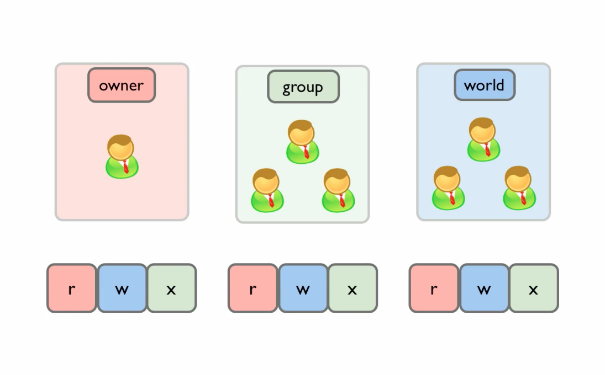
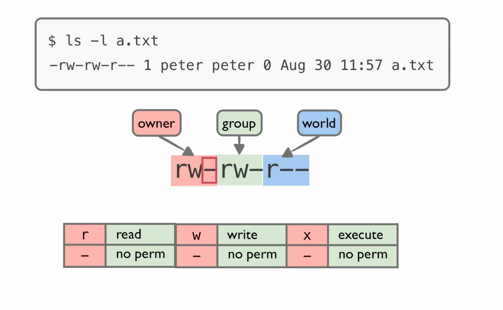
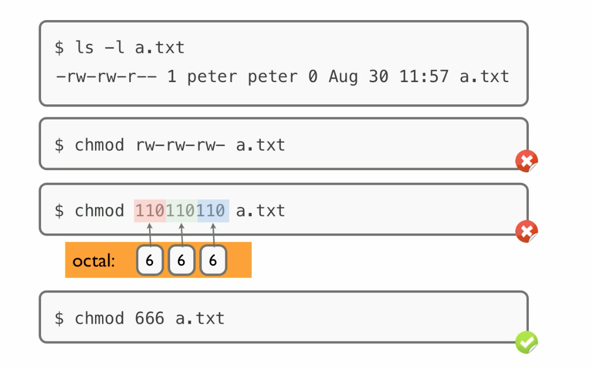

[观看视频](http://www.imooc.com/video/3531)

有一个概念必须明确：粗略的，用户在自己主目录下会拥有写权限，主目录之外一般只有读权限。如果我们到我们自己的主目录之外

    $ cd /
    $ touch aaa

就会报错 “Permission denied” 。解决这个问题有一个简单的方法，那就是变身管理员，或者叫超级用户

    $ sudo touch aaa

输入 peter 的密码就可以作为超级用户来执行这个操作了。实际中常见的例子就是如果我们用 apt-get 安装一个软件，一般会涉及到往我们主目录之外的地方安装文件，所以是要 sudo 的，例如

    $ sudo apt-get install vim

但是我们有时候也会发现，这个规则不是铁定的，比如这里我的主目录下有这么一个文件 a.txt 现在我想修改它

    $ echo Hello >a.txt

也报出了权限拒绝的错误。所以说权限问题还有深层原理，这就是我们这一课要集中解决的点，我们将一劳永逸的干掉 ”Permission Denied” 这个报错信息。

今天的视频我们分三部分：首先介绍三种权限，然后探究文件模式位，最后是使用 chmod 命令来修改用户权限。

# 三种权限

用户对文件通常会涉及“读”，“写”，“执行”
三种权限，当然 Linux 系统还规定了其他一些权限，不常用。

Linux 是一个多用户的操作系统，也就是很多用户可能同时使用一台计算机.
对于一个特定文件，系统会为他指定一个特定的用户( user )作为它的所有者( owner )。  同时也一定会指定一个由一个或多个人组成的 group，作为这个文件的所有者组( owner group )， 严格的术语就叫组( group ). 这两类之外的其他用户归为第三类人，叫 world 。这三类人各自的权限多少是可以任意指定的, 不一定谁多谁少，当然一般来讲 owner 的权限会多一些。

Linux对同一文件的权限控制，也是分了这三类人进行讨论的。权限问题基本上就是要讨论，所有者( owner ) 对文件的是否具有“读”，“写”，“执行”的权限。同样，如果对组( group 或者叫 owner group)，和其他人( world )的相应讨论也完成了，那权限就明晰了。

# 文件模式（ file mode ）

那么我们回到实际情况。对于文件权限的规定是通过文件模式（ file mode ）来控制的。

如果我们执行

    $ ls -l a.txt
    -rw-rw-r-- 1 peter peter 0 Aug 30 11:57 a.txt

得到的输出中，第一个`-`是关于“文件类型”的，这一位常见的情况有，`l` 表示符号链接，如果我们查看的是一个目录，那这里就会显示 `d` ，`-` 表示普通文件。

我们先跳过后面的9个字符，接下来的这个 `1` 表示的是硬链接( hard link )的数目。前后两个 `peter` 分别代表拥有者( owner )名和组( group )名。`0`是文件大小，以字节为单位，这里明显是个空文件。接下来是“最后修改时间”。

那剩下的9位就是“文件模式”。可以分位三组。第一组（前3位）规定的是所有者（ owner ）对该文件的权限，第一位表示 owner 对该文件是否有读权限,`r`
表示有，`-`表示没有，第二位表示 owner 对该文件是否具有写权限，`w`代表有，`-`
代表没有，第三位表示 owner 对该文件是否具有执行的权限，`x`代表有，`-`
代表没有。中间三位代表组（ group ）的情况，最后三位是对其他人（ world ）。这里，所有者和组用户对该文件有“读”和“写”的权限。其他用户都只有读权限。

如果我们要对目录( directroy )查看权限的话，要用

    $ ls -ld mydir
    drwxrwxr-x 2 peter peter 4096 Aug 30 15:45 mydir/

同样是读写执行三种权限，对于普通文件和目录代表的意义是有差异的。
用户对文件有读权限，意味着用户可以查看文件的具体内容。
对目录来说，就是可以看目录中所包含的文件名。

写权限对文件而言很好理解，就是我们可以修改里面的内容。那是不是也意味者我们可以对文件进行重命名或删除操作呢？
答案为否。这要看包含该文件的目录的权限。这就谈到了一个目录的写权限的意义，我们对于一个目录有写权限，意味着我们可以对其中包含的文件或子目录进行创建，重命名或删除（操作成功的前提是我们也同时拥有对该目录的执行权限）。

最后要谈的是执行权限(x),
我们对于一个二进制文件(例如程序的编译输出),或者是一些脚本文件，例如 shell 脚本，python ruby 等脚本，执行权限才有意义。
但是如果我们文件里存的是笔记或者是C程序的源代码，那执行权限是没有什么意义的。这就是为什么系统上的大部分普通文件，如果我们用`ls
-l`查看一下的话，都是没有执行权限的。但是正好相对的，我们用`ls
-ld`查看一下系统上的目录，发现基本上都是有执行权限的。
对于没有执行权限的目录，我们是不能跳转进去的，所以有没有执行权限，意味者我们能不能成功的 `cd` 到该目录里。

# 修改文件模式(chmod)

我们可以通过 chmod 这个命令来更改文件模式，也就是更改各类用户的具体权限。如果我们想对“其他”用户，在`a.txt`都上写的权限，那么可以凭空想象出这样一个命令

    chmod rw-rw-rw- a.txt

但是实际这个命令系统是不认的。然后，我们用1代表“使能”，0代表“禁止”，可以得到

    chmod 110110110 a.txt

那这个逻辑也是清晰的，但是很不幸`110110110`也不是 chmod 的合法参数。
我们再把这个参数写的短一点，也就是把它们分三组分别用八进制表示。最后得到的

    chmod 666 a.txt

是一个正确的系统命令，最后实现了我们的目的。

下面是动手演示。除了可以用八进制数来指导模式，也可以用英文字符作为参数的形式，例如实际中我使用 chmod 命令最多的一种情形是给我自己写的脚本加一个执行权限：

    $ vim peter.sh
    $ ./peter.sh
    Permission denied.
    $ chmod +x peter.sh
    $ ./peter.sh
    hello peter

要去除刚刚加上的执行权限，可以

    $ chmod -x peter.sh

其他的形式还有许多

    $ chmod +w file
    $ chmod -w file
    $ chmod a+x file
    $ chmod u+x file

命令多了容易记错，好在可以用 ls -l 随时观测这些更改。

另外，改变权限问题其实还有另外一个角度，我们也可以用 chown 来改变文件 owner 和 group ，这样也是可以改变特定用户对给文件的权限情况的。

具体使用我们就不演示了，您要是感兴趣可以看书：

<http://billie66.github.io/TLCL/book/zh/chap10.html>
