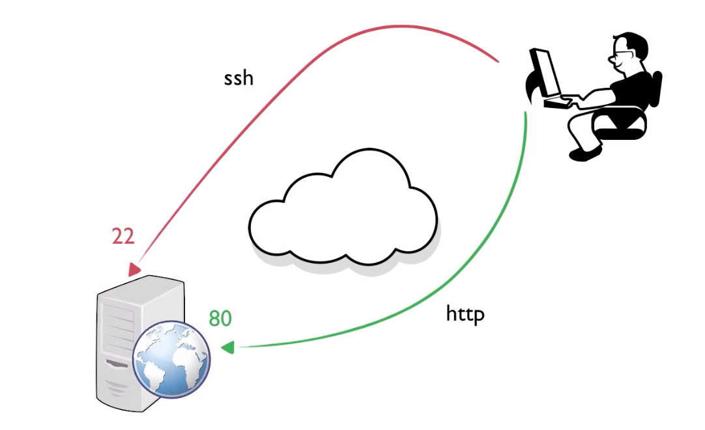
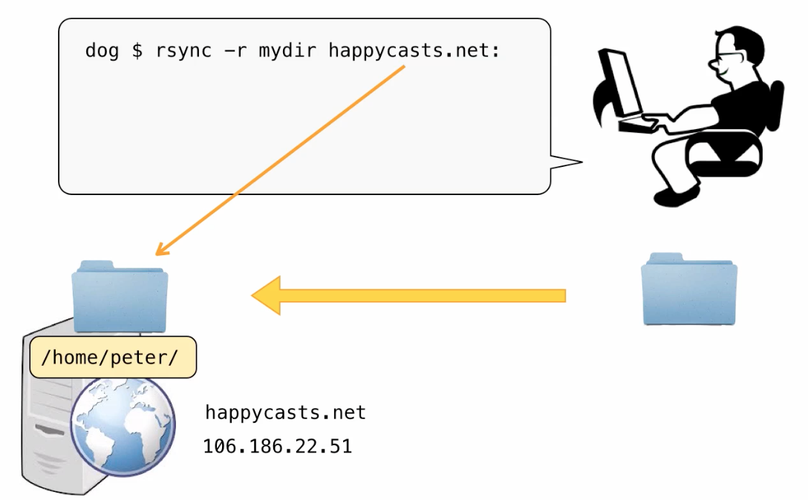

[观看视频](http://www.imooc.com/video/3555)

我是个网站开发者，写代码就在我本地的 ubuntu 机器上，但是网站写好了就要部署到服务器上了。我一般是花 10 美元一个月，买国外的 vps ，也装上 ubuntu 。问题就出来了：第一如何远程操作我的服务器？第二如果传输数据？

这就引出了这次我们要聊的两个强大的工具： 远程操作工具 ssh，数据传输工具 rsync 。

# ssh 远程操作

首先 ssh 是网络上两台机器互联的一套协议，默认走 22 端口，就跟 http 类似， http 默认走 80 端口。
22 端口开了，我们的通道就有了，但是还是要求，请求这一方要安装 ssh client，被访问的这一边要安装 ssh server 。

ubuntu 的 desktop 版，就是我本地用的这个带图形界面的系统，默认安装了 ssh 客户端，也就是我可访问他人

    $ ssh peter@happycasts.net

如果本地用户，和远端服务器上用户同名，这里的 peter 也可以省略。另外，happycasts.net 的机器是我在 Linode 上申请的一台 VPS 。上面我装了 ubuntu 12.04 的 server 版，默认是有 ssh 的服务器端的，所以我们才可以访问它。

每次都要输入密码挺讨厌的，可以通过添加 ssh key 的方式解决。首先在我自己的机器上

    $ ssh-keygen

会出现几个问题，都直接回车取默认值就可以了。这样

    $ cd ~/.ssh
    $ ls
    id_rsa id_rsa.pub

id_rsa 是 private key 这个是要严格保密的，id_rsa.pub 这个上传到服务器的指定位置上。

    $ ssh-copy-id peter@happycasts.net

 这样，我就把我的 id_rsa.pub 添加到服务器上的 /home/peter/.ssh/authorized_keys 文件之中，后面再用 peter 用户登录就不需要输入密码了。

ssh 登录之后，现在操作的就是我的服务器了。我可以打开配置文件修改一下，使用 vim 。也可以用

    $ tail -f log/development.log

查看 log 。这时就有问题出来了，如果我敲 ctrl-d 退出登录，或者网络出了问题，ssh 链接断开了。那我在服务器上正在操作的这个现场也就丢失了。维护住这个现场可以使用 tmux 。参考 <http://happycasts.net/episodes/41>

ssh 是通的，那么我就可以用 scp 来进行文件传输了。下载

    $ scp -r happycasts.net:mydir .

上传
    $ scp -r mydir happycasts.net:

注意最后的 `:` 不能省略。

# rsync

scp 是一次把整个的目录内容都拷贝了。如果要把本地的一个目录和远端保持同步则要用到 rsync 。

使用 rsync 的前提是，本地和远端要通 ssh （其他的协议也可以，不过也要配置才行）。

发挥和 scp 类似的命令把本地的一个目录上传到 happycasts.net 服务器上

    $ rsync -r mydir happycasts.net:

特别注意，mydir 后面不能有 / 不然会直接把 mydir 中的文件上传，而不上传 mydir 目录本身。另外，最后面的 `:` 是不能省略的。

要从服务器上，往本地下载数据，基本上就是把 rsync 后面的两个参数颠倒位置

    $ rsync -r peter@happycasts.net:mydir .

本地新添加文件后，如果要让远端也同步

    $ rsync -r mydir/ happycasts.net:mydir/

为保留更完整的文件信息，通常把 -r 参数改为 -a，-a 的具体功能，可以参考 manpage

要把本地删除的文件，在远端机器上也删除，可以使用 --delete

    $ rsync -a --delete mydir/ happycasts.net:mydir/

但是这样有个问题，万一在本地误删了文件，一同步，那远端的备份也被删了，加 -v 参数可以有信息提醒我们会增加或删除那些文件，但是看到信息的时候后悔也晚了。好在还有一个贴心的参数 --dry-run

    $ rsync -av --delete mydir/ happycasts.net:mydir/ --dry-run

这样就可以只报告信息，但是不真正进行同步了。实际中，每次我要同步数据的时候，都是先 dry-run 一次，看看没有误删除东西，然后再同步。每次都敲命令太麻烦，所以写了一个脚本：

    sync_dryrun()
    {
        echo
        echo -e "\033[1m ...dryrun...\033[0m"
        rsync -av --delete ~/Desktop/lgcb/video/ peter@happycasts.net:~/media/lgcb/ --dry-run
        echo -e "\033[1m ...dryrun...\033[0m"
        echo
    }
    sync_dryrun

    sync_server()
    {
        echo
        echo -e "\033[1m ...syncing...\033[0m"
        rsync -av --delete --progress ~/Desktop/lgcb/video/ peter@happycasts.net:~/media/lgcb/
        echo -e "\033[1m ...done...\033[0m"
        echo
    }

    echo -n "Want to sync? (Y/n): "
    read AAA
    if [ "${AAA:-y}" = "y" ];then
        sync_server
    else
        echo Nothing done, bye.
    fi

这两个大工具就介绍到这里，实际中还有一些是总会偶尔用到的，如 ftp curl ping ifconfig 等等。可以用到的时候 google 一下，或者参考 TLCL 17 网络：

<http://billie66.github.io/TLCL/book/zh/chap17.html>
