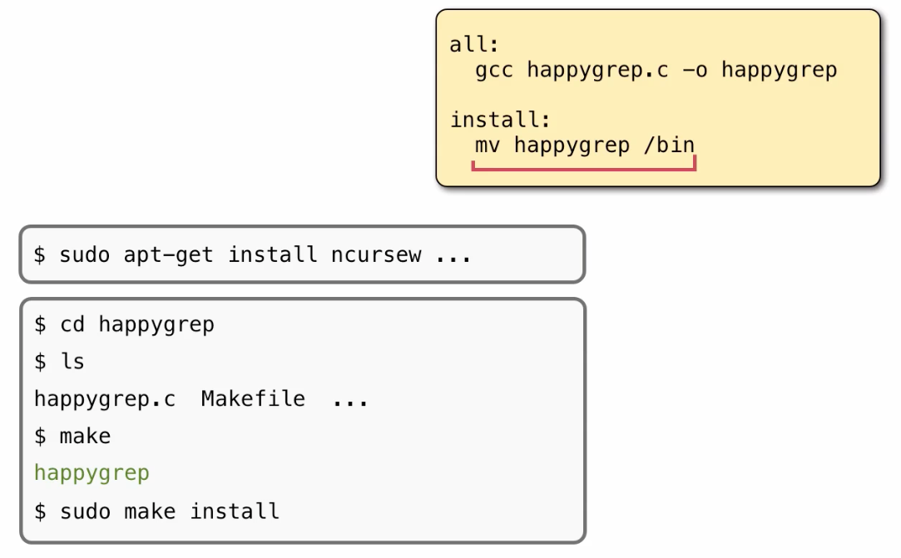
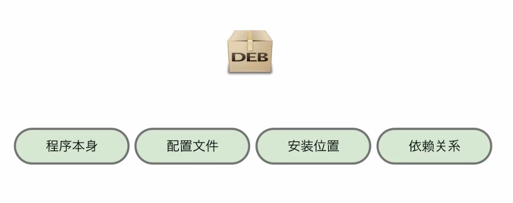
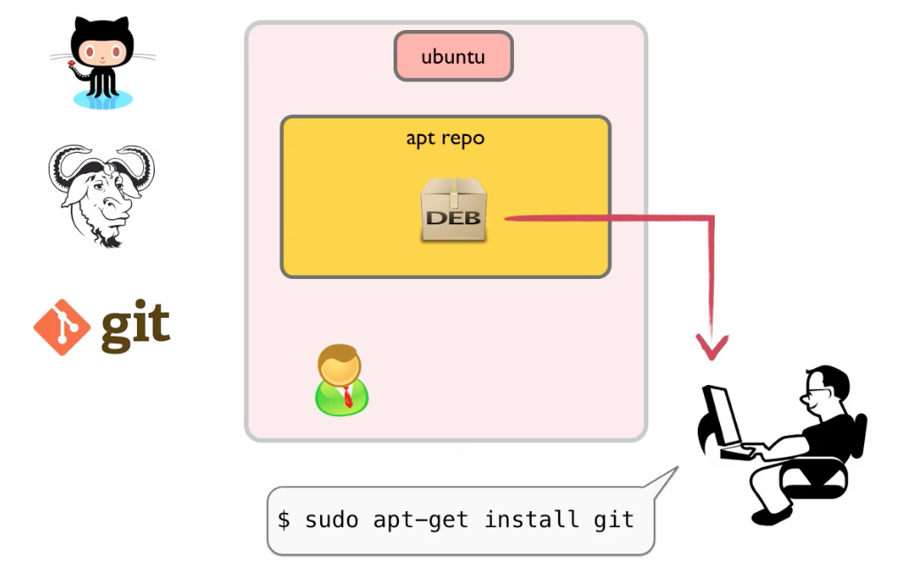

安装软件在 ubuntu 系统上主要有三种方式：

- 手动下载源码或者编译好的软件安装
- 下载 deb 包来安装
- 从 ubuntu 官方的仓库，用 apt-get 下载安装

本集就来说说它们的区别和联系。

# 手动安装

安装 sublimeText 编辑器。 在 <http://sublimetext.com/> 可以直接下载可执行的程序。解压缩自后可以放到系统上的任意位置，比如我们可以

    mv xxx ~/.sublime

可执行程序在哪里都可以执行，但是要加路径

    $ ./sublime_text

如果要让它变成一个系统命令，需要移动到 $PATH 中包含的一个目录中，也可以不移动，做个符号链接也行

    $ ln -s ~/.sublime/sublime_text ~bin/subl

注意：ubuntu 下默认 ~/bin 不是 $PATH 的一部分，但是如果你创建了 ~/bin 然后再重启，那就自动添加了。

这样 sublime_text 就安装好了。

手动安装中更为常见的一种形式是下载源码安装。Linux 系统上的软件一般都是开源软件，所以都可以下载到源代码。下载后的操作步骤就是像顺口溜一样的这几步：

    # 下载 gnu hello 做例子
    $ tar jxvf hello.tar.bz2
    $ cd hello
    $ ./configure
    $ make
    $ sudo make install

hello 还是太复杂。我的 happygrep 更简单，便于把道理说清楚。

Makefile 是这样的

    all:
      gcc happygrep.c -o happygrep -lncursesw  -Wall

    install:
      mv happygrep /bin

首先执行 make ，得到可执行的输出 happygrep ，再执行 make install 就会把可执行程序安装到 /bin 目录之下。

思路放宽一下，就会发现这种安装方式，如果安装的软件多了，我肯定会忘了都装了那些软件了，更记不得一个软件都在系统上安装了那些文件。这样卸载软件时岂不是一场噩梦。你可能会想，在安装软件的时候就把关于这个软件的有用信息都存放到一个数据库中，以后对各个软件的管理就会有章可循了。这样恭喜你，你已经有了 Linux 系统"包管理"的基本思想了。

# 软件 deb 包

ubuntu 下一班都会把软件做成 deb 的包来安装。为啥叫 deb ？ 因为 ubuntu 是 debian 系统的一个变体。一个 deb 包中会包含下面的信息：

下载 chrome 浏览器进行安装：

    $ dpkg -i chrome.deb

查看系统上所有的安装包

    $ dpkg -l

搜索 chrome 的包

    $ dpkg -l|grep chrome

查看这个包都安装了那些文件

    $ dpkg -L packagename

查看某个特定文件来自于哪个软件包

    $ dpkg -S /usr/bin/git

卸载 chrome 包，当然也可以用 dpkg 来做，不过我的做法还是使用 apt-get 来删除，下面马上就介绍。

打造自己的 deb 包，参考 <http://happycasts.net/episodes/14>

# 软件 apt-get 仓库

大部分的常用软件，都可以直接去 ubuntu 官方的 apt 仓库里直接下载安装。故事是这样，最早是软件原作者把自己的代码放到一些网站上。用户可以自己下载安装，但是 ubuntu 是个好心的公司，会有专人把源码下载下来，打造成一个 deb 的包，然后上传到工作的软件仓库中。这样我要做的就是敲

    $ sudo apt-get install git

那 git 这个软件的 deb 包就被 apt-get 下载到本地，同时 apt-get 也包裹了 dpkg 命令，所以直接把安装配置过程也完成了。也就是一个命令，git 就直接可以用了。

国内默认使用的仓库地址是：<http://cn.archive.ubuntu.com/ubuntu>
。这个需要在系统文件 /etc/apt/sources.list
中指定，我也可以自己修改使用其他的镜像。另外，有些包没有放在官方仓库中，也可以添加其他的仓库进来，google
一下 ubuntu “add ppa” 就可以找到方法了。

查找需要安装的软件包包名：

    $ apt-cache search ncurse
    $ sudo apt-get install libncurse<tab>

卸载软件包：

    $ sudo apt-get remove git # 保留配置文件
    $ sudo apt-get purge git  # 连配置文件一起清除

自己动手搭建软件仓库：<http://happycasts.net/episodes/15>

另外，在使用 apt-get 装包的时候，如果 A 依赖于 B 才能运行，那么 sudo apt-get install A 的时候 B 包也会自动被安装上，也就是能自动处理依赖问题。

当然有时候官方仓库中的包版本可能更新的不是特别及时，如果你必须要用新的版本，也可以自己去下载源码编译安装。所以前面咱们讲的手动安装还是会偶尔用上的。
