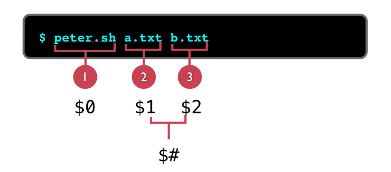
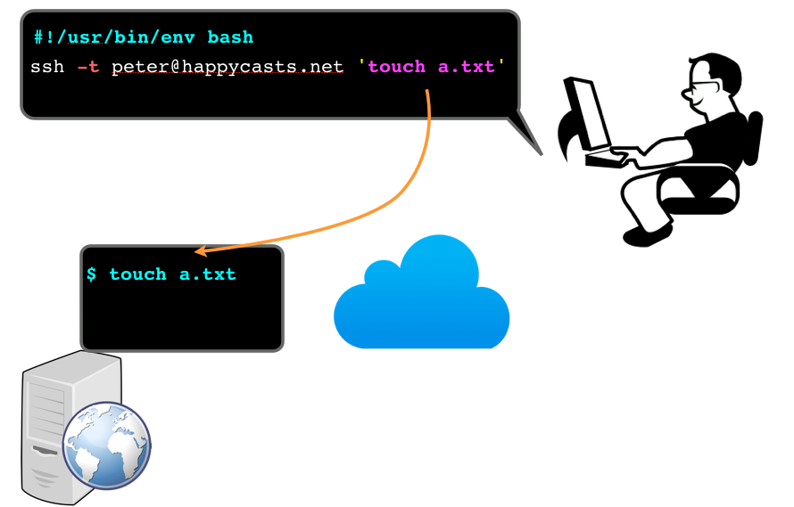

可以把很多命令直接流水账式的存放到一个文件中，Shell 可以把这个文件作为一个脚本来执行，这样我一次就可以干很多事情了。

举个例子，要准备一个 rails 程序的运行环境，需要在 Linux 系统上作很多工作。我可以把这些任务都罗列到脚本中 <https://gist.github.com/happypeter/5187692> 一劳永逸。

但是仅仅排队执行还是很有局限的。其实 shell 也可以支持各种循环嵌套和条件控制机制，使用了这些机制，脚本能够完成的任务就更加强大和灵活了。这就是 shell 脚本编程。

作为一名系统管理员，脚本编程的功夫必须要足够硬。但是对于开发者，我不建议大家系统的学习 shell 编程，随用随学就好。多年以来我只是感觉每多学一个技巧就能在命令行的使用中多一份高效。所以这里我把我觉得最最最常用的技巧总结为八个小点来跟你一一分享。

# 指定解析器

我现在使用的 shell 叫做 bash，要写的脚本是 bash 脚本。每个 bash 脚本的第一行都应该这样写

    #!/usr/bin/env bash

告诉命令行，用 bash 的语法来解析下面的语句。如果机器上安装了 ruby 或者 python，这样我也可以用这两种语言来写脚本，这样第一行就应该是

    #!/usr/bin/env ruby

或

    #!/usr/bin/env python

# 命令就是语句，语句就是命令

可以把语句直接罗列到脚本中，每一个命令都是合法的脚本语句。也可以把很多语句包裹到一个函数中

    #!/usr/bin/env bash
    say_hello()
    {
      echo "hello"
    }
    say_hello # 呼叫执行

所以说“命令就是语句”。

另一方面，有些元素一般都是出现在脚本中作为语句的一部分出现的

    if [ $# != 1 ]
    then
      echo "hello"
    fi

例如上面的 `[ $# != 1 ]` 其实也是可以放到命令行里直接执行的

    $[ $# != 1 ]
    $ echo $?
    0

查看返回值为 0 表示命令执行成功。也就是 if 后面只要跟一个正确执行的命令，例如

    if ls

if 都会认为条件为真，而如果跟一个执行会出错误的命令

    $ ls shit # shit 是一个不存在的位置
    $ echo $？
    2

这样 `if ls shit` 会被认为条件为伪。这个跟一般的编程语言中 0 为 false，非0为 true 是正好相反的。如果不理解“语句就是命令”就会感觉奇怪。另外由于命令对空格是敏感的，所以就造成脚本语句对空格是变态的敏感。

# 位置参数：

有几个变量很重要，先来执行下面的脚本

    #!/usr/bin/env bash
    echo "
    Number of arguments: $#
    The program name is: $0
    The first argument is: $1
    "

`$#` 代表命令执行的时候，一共有几个参数。 $0 代表命令名，$1 代码第一个参数，$2 代表第二个参数，以此类推。位置参数在编程中是极为常用的，尤其是 $1，稍后会有例子。

# 脚本不在当前 shell 里执行

每次启动一个脚本，系统都会专门另起一个当前 shell 的子 shell，来执行脚本中的语句。

例如，当脚本里导出一个环境变量

    #!/usr/bin/env bash
    export DIR="/home/peter/mydir/"
    cd $DIR
    touch a.txt

执行

    $./peter.sh

会发现，第一，在当前 shell 中 echo $DIR 得到的值为空，同时当前 shell 中我的工作目录也没有改变。

如果想让 shell 脚本中的语句在当前 shell 中执行，要使用

    $ source peter.sh

执行的结果差异是一目了然的。

# 循环控制

这次写个稍微复杂点的。

    cd $1
    echo Hey now I am in `pwd`
    for file in `ls` # `ls` 会取出命令的输出
    do
      mv $file $file.txt
    done

把这个脚本 rename.sh ，首先

    $ chmod +x rename.sh

 放到 ~/bin 中，就成了一个到处都可以找到的命令了。创建一个目录 mydir

    $ mkdir mydir
    $ cd mydir; touch a b c
    $ rename.sh mydir
    $ ls mydir
    a.txt b.txt c.txt

# 远程执行

前面我聊 ssh 的时候介绍过，你先登录到服务器上，然后再执行命令就可以操作服务器了。实际中每次都登录再操作也是太麻烦，能不能在我自己机器上执行一个脚本就把服务器上的事给办了呢？

可以。脚本里这样写

   ssh -t peter@happycasts.net 'touch aa'

那引号里面的命令，就都会在服务器上执行。

实际例子，把新写的代码更新到服务器

<https://gist.github.com/happypeter/4f6425afa7527e433cb6>

# 确认执行

让程序在半路停下，报告一些信息，用户根据信息判断下一步是否要执行一个操作，这就是确认执行。

    #!/usr/bin/env bash

    echo -n "Want to say hello? (Y/n): "
    read AAA
    if [ "${AAA:-y}" = "y" ];then
        echo hello
    else
        echo Nothing done, bye.
    fi

实际例子：<https://gist.github.com/happypeter/4248241>

# 其他语言也可以写脚本

shell 脚本的语法很机器化，很多细节可以说是晦涩。对于使用 ruby，perl 或者 python 的开发者，也可以用自己喜欢的语言来写脚本。
LGCB 这本书的转换 pdf 的工作最早是用 bash 脚本，现在开始用 ruby 重写了。ruby 确实人性化，写东西比较快。文件链接：<https://github.com/happypeter/LGCB/tree/gh-pages/tools>

又比如 [happygrep](https://github.com/happypeter/happygrep) 项目最早是一个 bash 脚本，但是后来用 C 语言重写了，当然这个是为了追求更好的用户体验了。

好，更多学习资源参考 TLCL 的 shell 编程的相关章节。
