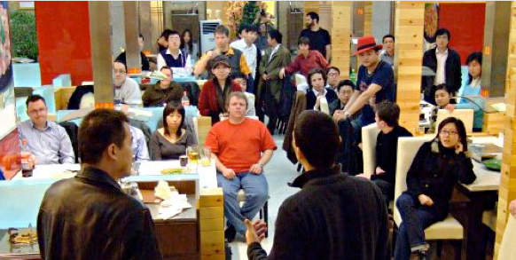
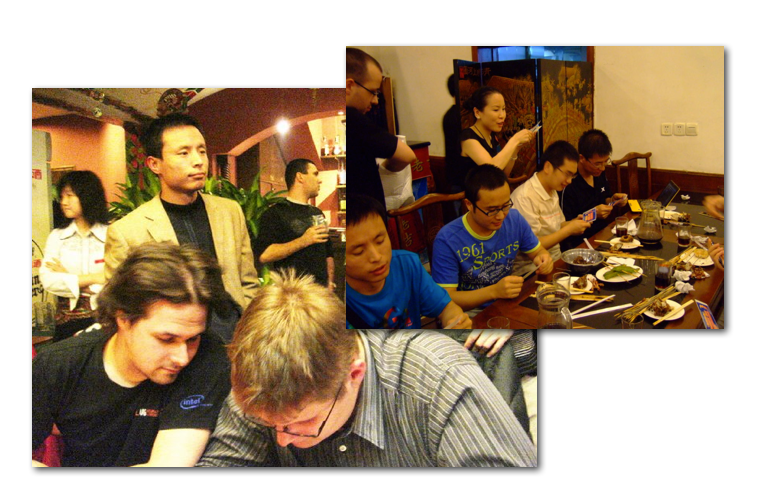

Linux For Complete Beginers 这门课接近尾声，今天说几句知心话。

想和你聊聊 Linux 的人文意义。

从小我都被灌输的概念是，如果你想要特立独行的自由，
可以当个艺术家，任意挥洒自己的才华。也可以当个小农，自给自足，老死不相往来。但是如果你出来和大家协作作一件庞大而精密的工作，你就必须牺牲一些个人的自由来换得组织的成功。

但是 Linux 的作者 Linus 可不这么认为。91 年他在自己的大学宿舍里发起了 Linux 项目，采用“赶集”一样的松散模式，带领全球几千人的自由开发者，做出了 Linux 操作系统，这个有史以来人类最大的软件项目之一。Linus 和人合写过一本书 Just For Fun，记录了这场不期而至的革命。

如果你在北京，欢迎你来参加 <http://beijinglug.org/>，这里有非常多的充满爱心的朋友，我自己在这里就得到过太多人无私的帮助。

奉上几张我在 Blug 的照片，我是 Peter，很高兴和你成为朋友。保持联络，Bye!

